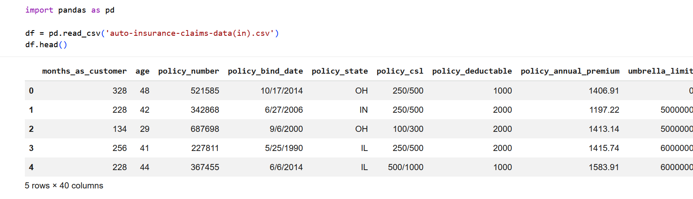
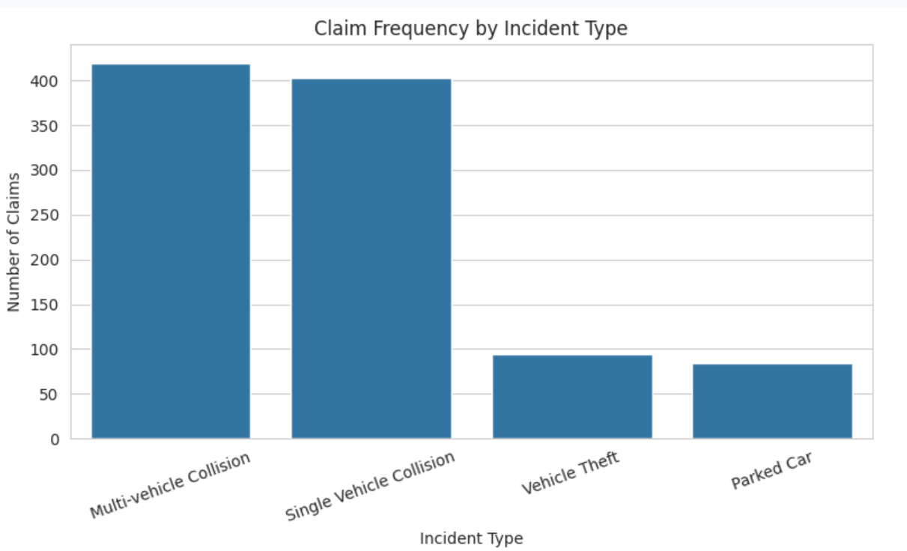
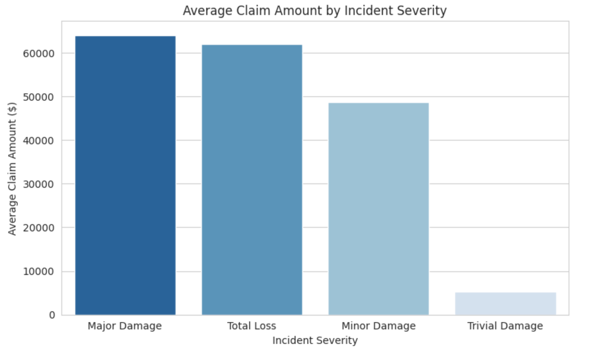
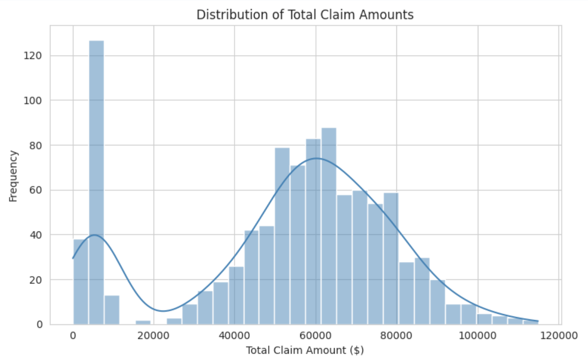
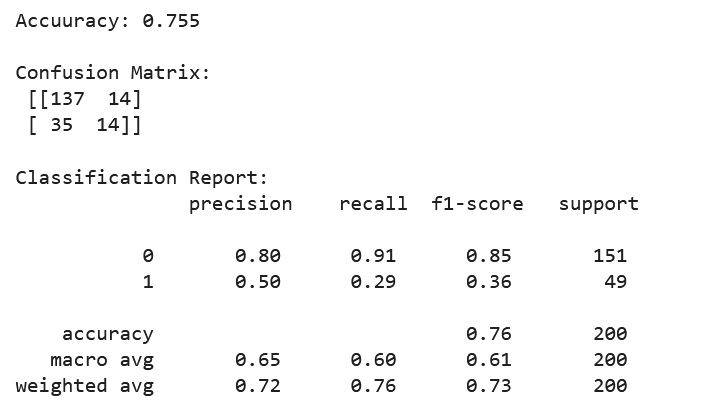
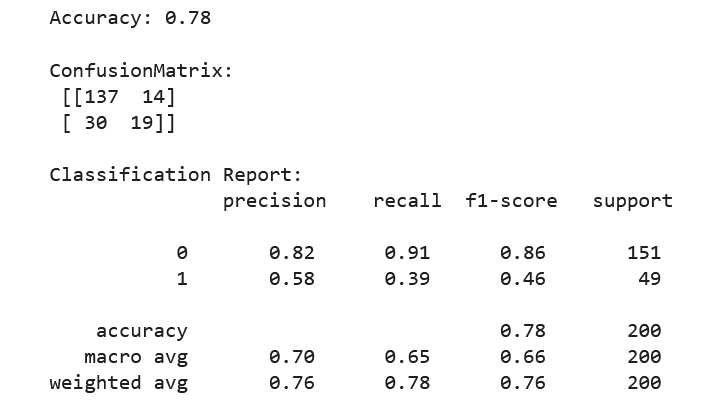

## Auto Insurance Claims Analysis ##
A Python-based exploratory data analysis and fraud-risk modeling project, built as a data analyst portfolio piece. this project ties together data cleaning, exploratory analysis, and a first-pass predictive model, with an emphasis on the kind of scrutiny an actuarial/financial-reconciliation background brings to messy real world data.

## Business Questions ##
1. How frequently do claims occur, broken down by incident type?
2. How does average claim amount vary by incident severity?
3. What does the loss ratio (claims paid vs. premiums collected) look like across states?
4. Can a simple model flag claims that are likely to be fraudulent, based on policy and incident features?

## Dataset ##
**Source**: [Kaggle - Auto Insurance Claims Data](https://www.kaggle.com/datasets/buntyshah/auto-insurance-claims-data) - 1000 policies, 40 columns, including policy details, incident characteristics, claim amounts(total/injury/property/vehicle), and a `fraud_reported` flag.

**Important limitation**: This dataset only contains policies that filed a claim - it is not a full book of business (no non-claiming policyholders are included). This matters directly for the loss ratio metric below.

## Tools ##
Python (Google Colab), pandas, matplotlib, seaborn, scikit-learn.

## Method ##
1. **Data Cleaning**
- Dropped an empty junk column (`_c39`) generated by the CSV export.
- Discovered '?' was used as a hidden missing-value placeholder in four categorical columns (`collision_type`, `authorities_contacted`, `property_damage`, `police_report_available`) - these don't get caught by pandas' default missing-value detection, so they had to be explicitly replaced with `NaN` and then filled with `"Unknown"` (rather than dropping rows, to preserve the full sample of 1000 policies).

2. **Core Metrics**
- **Claim frequency by incident type** - multi-vehicle collisions (419) and single-vehicle collisions (403) dominate; vehicle theft and parked-car claims are far less common.
- **Average claim amount by severity** - scales are expected: Major Damage ~$64 and Total Loss ~$62k claims are roughly 12x larger than Trivial Damage claims ~$5.3K, which is a useful sanity check that the data behaves logically.
- **Loss ratio by state** - computed as total claims paid ÷ total premiums collected. Came out to ~42x across all three states (IL, IN, OH). This number is **not a realistic book-of-business loss ratio** - it's inflated because the dataset only contains claiming policies. Flagged explicitly rather than reported at face value.

## Cleaned data preview: ##

3. ## Visualizations ##
- **Bar chart - claim frequency by incident type**

- **Bar chart - average claim amount by incident severity**

- **Histogram + KDE** - distribution of total claim amounts. Notably **bimodal**: one cluster of low-value claims near $0-10k, and a separate, larger cluster peaking around $60-65k. This suggests two distinct populations of claims (e.g. minor/partial claims vs. full vehicle-loss claims) rather than one continuous distribution.

4. ## Predictive Model - Logistic Regression (Fraud Flagging) ##
- Target: `fraud_reported`(Y/N), with a class of split of 753 non fraud/247 fraud (~25% fraud rate - notably higher than real-world fraud rates, another sign this is a curated sample).
- Features used: customer tenure, age, policy premium, total claim amount, incident severity, insured hobbies, number of vehicles involved, witnesses, and police report availability.
- Categorical features encoded numerically; numeric features scaled with `StandardScaler` before fitting.
- 80/20 train/test split, stratified on the target to preserve class balance in both sets.

| Metric | Value|
|---|---|
| Accuracy | 0.78 |
| Fraud (class 1) precision | 0.58 |
| Fraud (class 1) recall | 0.39 |
| Fraud (class 1) F1 | 0.46 |

**Key finding**: accuracy alone is misleading here. Because ~75% of the dataset is non-fraud, a model that always predicted "not fraud" would still score ~75% accuracy while catching zero real fraud cases. The meaningful number is recall on the fraud class - this model catches 39% of actual fraud cases, missing the majority. For an actuarial use case, this is a real limitation worth stating plainly rather than hiding behind the headline accuracy figure.

**Why scaling mattered**: the first model (unscaled features) threw a `ConvergenceWarning` and scored lower on every metric (75.5% accuracy, 29% fraud recall). Scaling didn't just silence the warning - it measurably improved the model's ability to distinguish fraud, since logistic regression's optimizer is sensitive to features being on wildly different scales (e.g. age in the tens vs. premium in the thousands).

## Before scaling: ##

## After scaling: ##

**With more time**, addressing the class imbalance directly (`class_weight='balanced'`, SMOTE oversampling, or a tree-based model like Random Forest/XGBoost) would likely improve fraud recall further. This was intentionally kept to a simple, well-understood baseline to demonstrate the full pipeline rather than chase maximum performance.

## Errors Hit & Fixed (Debugging Log) ##

| # | Error | Cause | Fix |
|---|---|---|---|
| 1 | `FileNotFoundError` | Left placeholder filename in `pd.read_csv()` instead of the real file | Uploaded CSV via Colab's Files panel, used the exact copied filename |
| 2 | `KeyError: ['_c39'] not found in axis` | Re-ran a cell that dropped a column a second time - Colab cells share state across runs | Added `if 'col' in df.columns:` guard before dropping |
| 3 | `ValueError: context must be in paper, notebook, talk, poster` | Used `sns.set('whitegrid')` - wrong function; that argument belongs to `sns.set_style()` | Changed to `sns.set_style('whitegrid')` |
| 4 | `AttributeError: Rectangle.set() got an unexpected keyword argument 'colour'` | Used British spelling `colour=` instead of matplotlib's expected `color=` | Corrected spelling |
| 5 | `SyntaxError / AttributeError` (multiple) | Typos: `fit_tranform → fit_transform, train_test_Split → train_test_split` | Careful re-typing; Python is case- and spelling- exact |
| 6 | `NameError: name 'df' is not defined` | Colab runtime disconnected after inactivity, wiping all in-memory variables | Re-ran cells from the top ("Runtime → Run all") |
| 7 | `ConvergenceWarning: lbfgs failed to converge` | Logistic regression fed unscaled features (e.g. age vs. premium on very different scales) | Applied `Standarscaler` to features before fitting |

## Key Findings Summary ## 
- Multi-vehicle and single-vehicle collisions account for the vast majority of claims (82%).
- Claim severity and claim amount scale together logically, validating data integrity.
- The claim-amount distribution is bimodal - two distinct claim populations exist (minor vs. total-loss claims) rather than one smooth distribution.
- The dataset's loss ratio (~42x) reflects that it's a claims-only sample, not a full policy book - a critical caveat for anyone reading the number of face value.
- A baseline logistics regression model achieves 78%  accuracy but only 39% recall on fraud - illustrating why accuracy is an insufficient metric on imbalanced classification problems, and where a more sophisticated approach (resampling, alternative algorithms) would be the natural next step.

## Files in this Repository ##
- `insurance_claims_analysis.ipynb` - full Colab notebook (cleaning → EDA → visualizations → model)
- `images`/ - screenshots referenced throughout this README
- Source dataset: linked above, not included  in this repo (see Dataset section)
